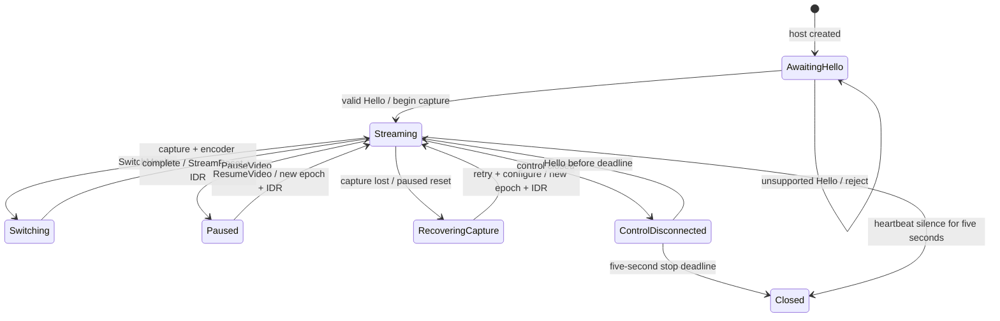
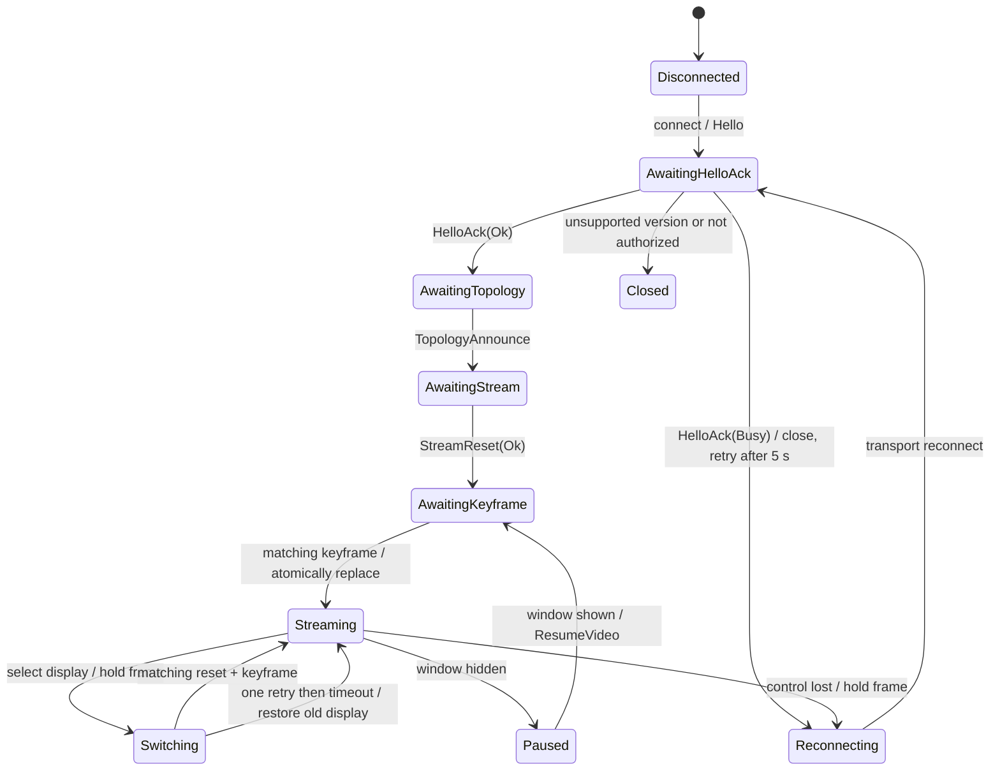

# Session State Machines

`racc-session` contains deterministic host and viewer state machines. The state layer accepts caller-supplied timestamps in microseconds and returns typed actions; adapters perform I/O, capture, encode, decode, rendering, and control-message delivery. `crates/session` forbids unsafe Rust and has normal dependencies only on `racc-proto`, `racc-topology`, and `racc-telemetry`; it does not depend on `racc-net`.

The legacy adapter methods without an explicit time remain as compatibility wrappers. Timer-sensitive callers should use the `*_at` methods, call `on_control_activity_at` for every valid control message, and call `tick(now_us)` regularly. Production adapters still need to pass actual monotonic timestamps through every timer-sensitive event; the current core/host adapters do not yet route all timer inputs through these methods.

## State transitions

## Inputs and actions

All timestamps below are virtual microseconds supplied by the caller. Methods ending in `_at` accept the event time explicitly. `tick(now_us)` advances timers without sleeping.

| Side | Input/API | Effect |
|---|---|---|
| Viewer | `on_connect_at(now)` | Sends Hello and arms the five-second handshake deadline. |
| Viewer | `on_hello_ack_at(ack, now)` | Accepts the handshake, ends on unsupported version/not authorized, or retries Busy after five seconds. |
| Viewer | `on_control_activity_at(now)` / `on_pong(pong, now)` | Refreshes control liveness; valid Pong samples update `PingTracker` and `RttEstimator`. |
| Viewer | `on_topology` / `on_stream_reset_at(reset, now)` | Validates topology and reset epoch/revision; a valid reset arms first-keyframe timers. |
| Viewer | `switch_display(id, now)` | Sends a request with a stable request id and starts a two-second response timer. |
| Viewer | `on_packet_loss(now)` / `on_decoder_error(now)` | Requests a keyframe; decoder failures also request a decoder reset and event. |
| Viewer | `on_pause` / `on_resume` | Sends pause/resume; a resumed stream waits for a fresh reset and keyframe. |
| Viewer | `tick(now)` | Sends heartbeat pings, retries a switch once, requests keyframes, resets a stalled decoder, and schedules reconnects. |
| Viewer | `on_decoded_frame_at(epoch, key, now)` | Rejects stale epochs and only promotes a pending image on a matching keyframe. |
| Host | `on_hello_at(hello, now)` | Responds Busy while a session is active; otherwise announces topology and starts the initial capture. |
| Host | `on_ping(ping, now)` / `on_pong(pong, now)` | Answers Ping and records control activity. |
| Host | `on_switch_monitor` / capture and encoder results | Switches the capture target and publishes a new reset epoch after successful configuration. |
| Host | `on_capture_lost(reason, now)` / `tick(now)` | Pauses output and retries capture using the bounded backoff ladder. |
| Host | `on_keyframe_request_at` / `on_force_keyframe_signal` | Coalesces forced IDRs so at most one is emitted per 100 ms. |
| Host | `on_encoder_failure_at(now)` | Tracks a rolling ten-second failure window; the third failure selects software encoding. |
| Host | `on_control_disconnected(now)` / `tick(now)` | Stops capture and encoding after the owner-selected five-second timeout. |

Actions carry protocol messages, capture/encoder operations, decoder resets, reconnect instructions, events, and frame-promotion decisions. Frames and sockets do not enter `racc-session`.

## Timing constants

Timer policy is exposed as named integer millisecond constants. Timer-sensitive APIs continue to accept virtual monotonic timestamps in microseconds; the `_US` constants are their microsecond equivalents where the state machine needs them. The Busy retry and encoder failure window are also named in milliseconds.

| Constant | Value | Behavior |
|---|---:|---|
| `HEARTBEAT_INTERVAL_MS` | 1,000 | Viewer sends one Ping per second after HelloAck. |
| `HEARTBEAT_TIMEOUT_MS` | 5,000 | Five seconds without valid control activity ends the viewer control session; host heartbeat silence also stops the host. |
| `HANDSHAKE_TIMEOUT_MS` | 5,000 | Viewer handshake and initial topology deadline. |
| `BUSY_RETRY_DELAY_MS` | 5,000 | Viewer retries a HelloAck(Busy) after five seconds. |
| `SWITCH_TIMEOUT_MS` | 2,000 | Same SwitchMonitor request is retried once; a second expiry restores the prior display. |
| `FIRST_KEYFRAME_NUDGE_MS` | 1,000 | Request a keyframe if the reset epoch has no decoded keyframe. |
| `FIRST_KEYFRAME_RESET_MS` | 5,000 | Reset the decoder and request again; the reset interval repeats until a keyframe arrives. |
| `RECONNECT_BACKOFF_MS` | `[500, 1000, 2000, 4000, 5000]` | The final five-second delay repeats. |
| `HOST_ORPHAN_TIMEOUT_MS` | 5,000 | Owner-selected override to M3b's ten-second default: stop streaming five seconds after control disconnect. |
| `FORCE_IDR_MIN_INTERVAL_MS` | 100 | Coalesce additional IDR requests into one pending request. |
| `CAPTURE_RECOVERY_BACKOFF_MS` | `[50, 100, 200, 400, 800, 1000]` | Repeat the final one-second delay. |
| `ENCODER_FAILURE_THRESHOLD` / `ENCODER_FAILURE_WINDOW_MS` | `3` / `10000` | Three failures inside ten seconds select software H.264. |
| `KEYFRAME_REQUEST_MIN_INTERVAL_US` | 200,000 | Viewer-side loss requests remain rate limited. |

## Epoch and display switch rules

The host increments a wrapping `u16` epoch for each stream reset. A viewer accepts only a serially newer epoch; duplicate, stale, or half-range-ambiguous epochs are ignored. Packet epoch filtering remains the transport/reassembler's responsibility.

A viewer holds the previously rendered image when switching. The host's matching reset configures the new decoder and arms the keyframe deadline. Only a decoded keyframe for the adopted epoch can return `VideoDisposition::Replace`; this is the renderer's atomic promotion point. A matching switch response ends the response timer. If it does not arrive within two seconds, the same request id is retried once; after the second timeout, the pending selection is abandoned and the previous selected display remains active.

`choose_stream_params(display_width, display_height, preference, host_caps, bitrate_hint)` keeps 30 fps, uses even NV12 dimensions, caps output at 1920x1080, and does not upscale beyond the display's height. It preserves aspect ratio subject to even-pixel rounding and the width/height caps. Automatic quality uses the host's default height. A viewer bitrate hint is honored only from 250 kbps through 20 Mbps; otherwise a host tier override or the 1.5/3.5/7 Mbps tier default is used.

Table evidence from `choose_stream_params` with fixed 1080p and default host caps:

| Display | Selected output | Default bitrate |
|---|---:|---:|
| 1366x768 | 1366x768 | 7 Mbps |
| 2560x1080 ultrawide | 1920x810 | 7 Mbps |
| 1080x1920 portrait | 608x1080 | 7 Mbps |
| 3840x2160 | 1920x1080 | 7 Mbps |
| 640x480 | 640x480 | 1.5 Mbps |

## Failure mapping to AGENTS.md section 8

| Failure | Session behavior | Remaining boundary |
|---|---|---|
| Capture lost | Pause encoder, emit Paused reset/new epoch, retry with `CAPTURE_RECOVERY_BACKOFF_US`, resume with a new reset and keyframe. | Platform capture recovery is implemented by adapters and needs hardware verification. |
| Network path change | `on_network_path_changed` emits a path event, requests a keyframe, and asks the quality controller to step down or restore. | Loss/RTT adaptation remains in the quality controller. |
| Incomplete frame | Viewer marks the current epoch as needing a keyframe and rate limits requests to 200 ms. | Reassembly/drop behavior is in `racc-net`. |
| Decoder error or stall | Reset decoder, keep last good frame, request a keyframe, emit `DecoderReset`. | Runtime stall detection is outside this crate. |
| Encoder failure | Rebuild hardware; after three failures in ten seconds switch to software; software rebuild failure emits `EncoderFailed`. | Platform encoder correctness requires hardware verification. |
| Control drop | Viewer reconnects on the documented schedule; host stops after five seconds. | Adapters must pass actual timestamps and execute actions. |
| Missing macOS permission | Not represented as a session transition; surfaced by the app permission flow. | macOS permission testing is HUMAN-PENDING. |
| Peer not allowlisted | Not represented as a session transition; allowlist/identity authorization belongs to host identity/control setup. | The scenario harness and end-to-end authorization path remain incomplete. |

## Acceptance status

The M3b fake host/viewer harness uses a deterministic virtual clock and a bounded in-memory control/video queue. It scripts capture and encoder completion and supports delayed, dropped, and reordered control traffic plus dropped keyframes. No socket, thread, OS clock, capture backend, or UI is used. The current focused suite passes 100 tests; the 10,000-case property run is recorded below.

The 20 integrated scenarios all pass:

1. `scenario_happy_path_connects_and_promotes_first_fake_keyframe`
2. `scenario_selects_second_display_and_holds_then_replaces_keyframe`
3. `scenario_display_disappears_mid_switch_restores_previous_display`
4. `scenario_rapid_triple_switch_reorders_controls_and_ignores_stale_replies`
5. `scenario_switch_retry_then_failback_after_dropped_control`
6. `scenario_host_initiated_resolution_reset_reconfigures_streaming_display`
7. `scenario_host_reset_for_switch_target_is_accepted_during_switch`
8. `scenario_pause_resume_and_unexpected_paused_frames_hold_last_image`
9. `scenario_control_loss_streaming_reconnects_and_resumes_selected_display`
10. `scenario_control_loss_during_switch_discards_pending_selection_on_reconnect`
11. `scenario_not_authorized_ends_without_reconnect`
12. `scenario_busy_host_retries_after_five_seconds`
13. `scenario_version_mismatch_is_terminal`
14. `scenario_capture_loss_recovers_after_a_topology_change`
15. `scenario_hardware_encoder_failures_fall_back_then_report_software_failure`
16. `scenario_first_keyframe_nudge_and_decoder_reset_use_virtual_time`
17. `scenario_forced_idr_requests_are_coalesced_to_one_frame`
18. `scenario_delayed_control_message_is_delivered_at_virtual_deadline`
19. `scenario_orphan_timeout_stops_stream_at_owner_selected_five_seconds`
20. `scenario_stuck_key_is_released_when_control_disconnects`

`PROPTEST_CASES=10000 cargo test --offline -p racc-session` passes all unit, scenario, and property tests. Table-driven stream selection covers 1366×768, 2560×1080, 1080×1920, 3840×2160, and 640×480. The viewer input API suppresses pointer input while switching but forwards accepted keyboard/wheel events against the adopted stream mapping. The host validates event epoch, display, HID usage, modifiers and mouse buttons, tracks held keys/buttons, and emits releases on pause, control loss, capture loss, terminal software-encoder failure, session end, and display remap.

The pure M3b session acceptance checks are complete. Platform adapters must still pass explicit timestamps and execute the emitted actions; actual capture/encode/decode, network authorization, input injection, and hardware session behavior remain COMPILE-ONLY, TESTED-FAKE, or HUMAN-PENDING as listed in the relevant progress and hardware sections. The integrated scenario exercises NotAuthorized handling; real Tailscale whois/allowlist behavior remains an identity/host-agent integration and hardware check. M3b ADRs are [0045 single viewer per host](decisions/0045-single-viewer-per-host.md), [0046 input during switching](decisions/0046-input-during-switch.md), and [0047 sans-I/O session core](decisions/0047-sans-io-session.md).
